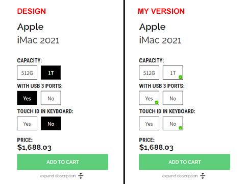
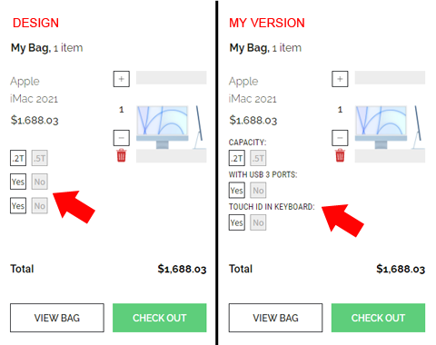
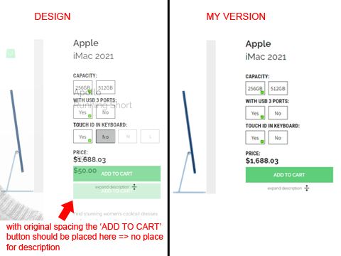
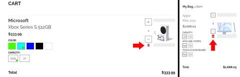
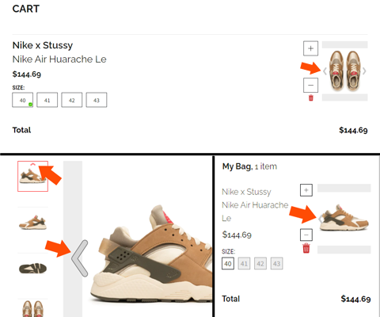
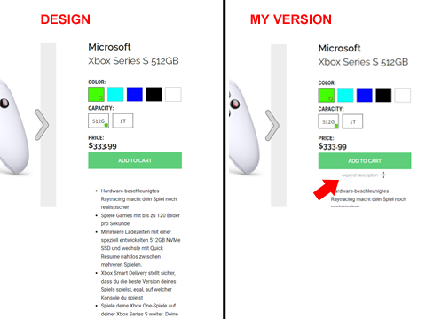
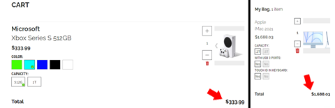
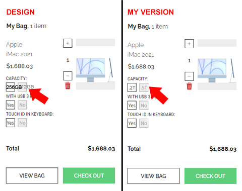

#Scandiweb Junior Developer test

I'm happy to present my implementation of the test. Some of the details are briefly described below.

## How does my solution meet the requirements?
### 1. Requirements from the article 'Entry React developer TEST':
- The functionality is implemented exactly as-per-design with some exceptions, the reasons for which I will explain below.
- Close to pixel-perfect design match.
- Both layout and functionality are completely scalable. You can easily add categories, products, currencies, etc.
- The entire application is written in React + Redux.
- There are only class components.
- Application is created with CRA.
- No UI libraries - only SASS and styled components.
- PLP, PDP, Cart page, Cart overlay (minicart) are fully functional and consistent with the design.
- Ability to add/remove products and change their amounts in cart - on the cart page itself, PLP and PDP: these requirements have been specified in the FAQ, see paragraph 2.
- For products that have various options (attributes) - the options can be selected.
- The selected options of added to cart products are visible in Cart overlay and in Cart page.
- Attribute with type 'swatch' (= 'Color') is rendered as color, not as its value. Adding other attributes with this type will not be a problem.
- Only products with the corresponding category value are displayed on the category page.
- The descriptions provided in HTML format are parsed and presented as HTML.
- When choosing a currency, prices in the entire project are immediately displayed in the selected currency.
### 2. Requirements rom FAQ/frequently asked questions:
- Backend is not pushed to GitHub.
- Router from react-router-dom is used.
- Click on 'View Bag' button opens the Cart page.
- Icons were taken from Figma and converted to url.
- I have hardcoded only Cart page and a stub 'CHECK OUT' page, just to save scalability. All other links are dynamic.
- Currency Switcher list closes on click outside the component.
- Currency Switcher icon changes on currency select.
- Currency Switcher items are highlighted on hover.
- Cart item total quantity badge on the cart icon displays the total cart item quantity.
- To the question of adding / removing products:
  - from PLP = you can click on the round green cart icon, in which case the product that doesn't have any attributes will be added, while you stay on the PLP page, or
  - from PLP = you can click on the product image, in which case you go to the product's PDP page, where you can select the desired attributes,
  - from PDP = you can select the desired attributes and then add the product to the cart,
  - from Cart page = you can increment / decrement the number of products already placed in the cart, as well as remove these products from the cart,
  - from Overlay cart (minicart) = the same as from the Cart.
## Where I deviated from the requirements. With explanations of the reasons
  >*The application is written in such a way that all my changes can be easily rolled back. Therefore, if you feel that my changes are inappropriate, I could very quickly bring the project into full compliance with the design.*

1. If an attribute has two values, for example 'Yes' and 'No', then marking the selected one with a black background can be misleading. It is not immediately clear what is selected: 'Yes' or 'No'. I made a selection with a little green icon. This option also works well for the color attribute.
  

2. If a product has several attributes, it is not clear which of them are displayed in the cart and overlay cart. So I added attribute names.  
   

3. PDP: compared to the design I reduced the spacing between price and 'ADD TO CART' button. Otherwise, for a product with 3 or more attributes, the button goes down, below the image, so the page composition breaks.  
    

4. It seems to me that the 'Delete item' button is absolutely necessary in Cart and Overlay Cart, so I added a trash can icon with the appropriate functionality.  
  

5. In the Cart in design, the slider arrows are visible in the product image. I assumed that the PDP and Overlay Cart should also have sliders. I added them and provided the appropriate functionality. In the PDP, the side and main sliders are synchronized.  
  

6. Some products have very long descriptions. In the Cart component, I added 'expand description' and 'collapse description' buttons, which only appear if the description goes beyond the bounds of the original layout for that component.  
  

7. In design, Overlay Cart has a total block, but Cart does not. I added the total in Cart as well.  
  

8. Long attribute values like '256GB' do not fit in small blocks in Overlay Cart, so I changed the value (256GB => 0.2T).  
  

## Beyond requirements
  1. To display prices with currency, I applied localization using Intl.NumberFormat, according to ISO 4217, languages according to
     BCP 47.
  2. The state of the Cart is stored in localstorage. The Cart state in store and in localstorage are synchronized on every change.  

## Updates after the first check 11th April 2022
### Here are the points of feedback that I needed to fix:  
>*1. All eslint errors must be fixed.*
> 
Done
>*2. Currency Switcher cannot be opened by clicking on the icon.*  
> 
Done
>*3. Currency Switcher doesn't close on currency select.*
>
Done
>*4. The Currency Switcher dropdown doesn't have any visible border to distinguish it from the background. Please add the box-shadow like in the design.*  
> 
Done. Added `box-shadow: 0 4px 35px 0 rgba(168, 172, 176, .19)` as in design.s
>*5. Cart Overlay backdrop doesn't cover the entire screen.*  
>
Done. Cart Overlay backdrop covers the entire screen now.
>*6. The out-of-stock products don't appear to be out of stock.*  
>
Done
>*7. It shouldn't be possible to add an out-of-stock product to the cart.*  
>
Done
>*8. Attribute value doesn't fit the box.*  
>
? I haven't found this issue. Would you point me to where it is, please? I'll try to fix it right away.
>*9. The cart item total quantity badge on the cart icon should display the total cart item quantity, not the cart item count.*  
>
Done
>*10. Cart Overlay doesn't fit the screen when there are too many products.*  
>
? In Amazon, AliExpress etc applications long cart doesn't fit the screen. Most likely, I do not quite understand what is meant. Could you explain me please, what kind of compression, transformation etc I need to implement, I'll do it as soon as possible.
>*11. Please don't use the style prop with constant values. Move such styles to CSS.*
>
Done. Styled components are left:  
* 4 in the Gallery. They all take in props variables for length, width, etc.  
* 1 in the ProductAttribute. It takes color index variables.
* 1 in the ProductDescription. It takes height variable.  

For all other components, the styles have been transferred to css.
>*12. dangerouslySetInnerHTML is dangerous. Please try to find a safer way.*
>
The vulnerable HTML-parsing method 'dangerouslySetInnerHTML' has been replaced with an XSS-safe component Markup from the lib 'Interweave'.

revised: 13th April 2022
